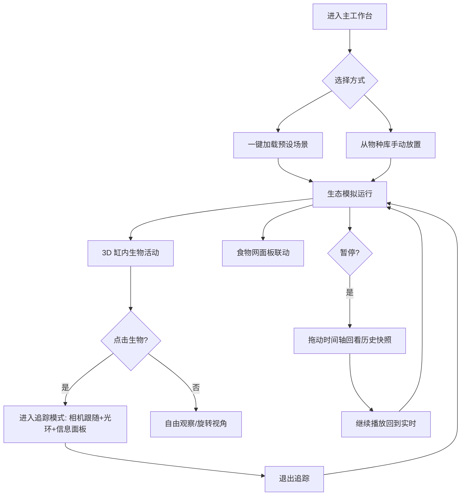

# 产品需求文档：3D 虚拟生态缸（EcoSphere Lab）

## 1. 产品概述

面向中小学自然观察课的 3D 虚拟生态缸教学工具，学生可在一个透明生态缸内放置不同物种，实时观察食物链、种群消长与昼夜节律。

- **目标用户**：中小学学生与自然课教师；用于生态、食物链、物种关系的可视化教学。
- **核心价值**：把抽象的"食物网""能量流动""昼夜节律""环境扰动"变成可交互、可回放、可追踪的 3D 实验，降低真实饲养门槛与时间成本，支持"假设—观察—回看"的探究式学习。

## 2. 核心功能

### 2.1 用户角色

| 角色 | 进入方式 | 核心权限 |
|------|----------|----------|
| 学生（默认） | 直接打开页面 | 放置/移除物种、切换预设场景、播放/暂停、拖动时间轴、追踪生物、查看食物网与信息面板 |
| 教师（演示） | 同上（投屏使用） | 一键加载预设场景、讲解食物网节点、调快时间倍率进行长周期演示 |

### 2.2 功能模块

1. **3D 生态缸主场景**：透明玻璃缸体、水体/地表、光照、生物游动与生长、点击选中。
2. **物种放置面板**：按"生产者/消费者/分解者"分类的物种库，点击即在缸内生成。
3. **预设场景库**：淡水湖泊、热带雨林微缩、污染水域，一键加载完整生态系统。
4. **生物追踪模式**：点击生物后相机自动跟随、生物光环高亮、右侧信息面板实时刷新。
5. **昼夜循环系统**：太阳/月亮移动、白天明亮夜晚昏暗、夜间生物休眠（减速、发光、生产者停止产能）。
6. **食物链/食物网面板**：可交互节点图，点击节点高亮缸内对应物种，悬停显示捕食/被捕食关系。
7. **时间轴与历史快照**：播放/暂停、倍速、拖动时间轴回看任意时刻的生态快照与种群数据。

### 2.3 页面详情

本产品为**单页应用（SPA）**，所有功能集中在一个主工作台内，分为三个区域 + 一个 3D 画布。

| 页面名称 | 模块名称 | 功能描述 |
|----------|----------|----------|
| 主工作台 | 3D 生态缸画布 | 渲染缸体、水体、生物；支持轨道相机旋转/缩放；点击生物选中；昼夜光照实时变化；追踪模式下相机平滑跟随 |
| 主工作台 | 左侧：物种与场景面板 | 物种按营养级分类列出（名称、图标、简介），点击放置；顶部为预设场景卡片（淡水湖泊/热带雨林/污染水域），一键加载 |
| 主工作台 | 右侧：食物网面板 | SVG 食物网：节点为物种、有向边为捕食关系；点击节点高亮缸内同类并联动信息；悬停节点弹出"捕食 / 被捕食"详情 |
| 主工作台 | 右侧：生物信息面板 | 选中/追踪生物时显示：物种名、营养级、能量值、年龄、状态（活跃/休眠/死亡）、当前捕食目标；追踪模式下实时刷新 |
| 主工作台 | 底部：时间轴控制台 | 播放/暂停、1x/2x/4x 倍速、当前时刻与昼夜指示、可拖动时间轴；历史快照以缩略刻度标注；回看时显示"快照模式"标识 |
| 主工作台 | 顶部：状态栏 | 标题、当前种群总数、各营养级数量、已模拟天数、重置按钮 |

## 3. 核心流程

### 3.1 加载预设场景并观察

学生进入页面 → 默认加载"淡水湖泊" → 生态缸自动开始演化 → 学生观察生物游动/捕食 → 可拖动轨道相机环视 → 调整倍速快速观看种群变化。

### 3.2 放置物种与观察食物链

学生在左侧物种库点击某物种 → 缸内随机位置生成该生物 → 若存在捕食关系，高营养级生物会主动捕食 → 食物网面板对应节点点亮 → 种群数量实时变化。

### 3.3 追踪某一生物

学生点击缸内某生物 → 该生物出现光环高亮、相机平滑切换为跟随 → 右侧信息面板实时显示其能量/状态 → 再次点击空白或按"退出追踪"返回自由视角。

### 3.4 昼夜循环

系统时间推进 → 太阳东升西落、环境光由亮变暗 → 夜间月亮升起、整体偏蓝偏暗 → 日行性生物减速休眠、部分夜行性/发光生物活跃、生产者停止能量产出 → 黎明恢复。

### 3.5 暂停并回看历史快照

学生点击暂停 → 时间轴可拖动 → 拖到某历史刻度 → 画布与数据回放到该时刻的快照（只读）→ 点击播放回到实时并继续演化。

## 4. 用户界面设计

### 4.1 设计风格

**美学方向：自然博物馆 × 科学田野笔记（Refined Naturalist）**。整体像一件可以上手操作的博物馆展项：深色玻璃缸占据视觉中心，周围是温润的"纸质感"面板，搭配精致的衬线标题与清晰的无衬线正文。克制、考究、有教育的庄重感，但通过微交互与生物动效保持活泼。

- **主色**：深松绿 `#0F3D33`（缸体/顶栏）、暖纸白 `#F4EEE2`（面板背景）。
- **辅助色**：清水青 `#2E8B8B`、暮砂金 `#C9A24B`、夜幕蓝 `#1B2A4A`。
- **强调色**：珊瑚橙 `#E8704A`（选中/捕食/高亮）、荧光青 `#6EE7D6`（夜间发光/追踪光环）。
- **营养级配色**：生产者绿、初级消费者青、次级消费者琥珀、顶级捕食者珊瑚红，用于食物网节点与生物本体主色，保持认知一致。
- **按钮风格**：圆角 10px、轻微投影、悬停时抬升并出现 1px 描边；主按钮深松绿底白字，次按钮纸白底深字带细描边。
- **字体**：标题使用 `Fraunces`（有性格的衬线体），正文与数据使用 `Hanken Grotesk`；数据数字使用等宽变体便于阅读。
- **布局风格**：3D 画布全屏铺底；左右两侧为半透明浮层卡片（毛玻璃 + 纸色叠加），底部为时间轴控制条；卡片之间留足呼吸感，圆角统一 16px。
- **图标/Emoji**：使用线性图标（lucide-react）+ 极简物种符号；物种在食物网中以"彩色圆点 + 首字"标识，避免贴图依赖。

### 4.2 页面设计概览

| 页面名称 | 模块名称 | UI 元素 |
|----------|----------|---------|
| 主工作台 | 3D 生态缸画布 | 深色玻璃缸、水体雾效、沙地/水草、动态方向光、夜间 Bloom 发光、轨道相机、生物点击涟漪、追踪光环呼吸动画 |
| 主工作台 | 左侧物种与场景面板 | 顶部场景卡片横排（缩略渐变图+名称）；下方物种分组列表（彩色圆点、名称、营养级标签、+ 按钮）；滚动区 |
| 主工作台 | 右侧食物网面板 | SVG 力导向/分层布局食物网；有向边；节点悬停高亮关联边；点击节点缸内同类闪烁；下方图例 |
| 主工作台 | 右侧生物信息面板 | 追踪时显示：大标题物种名、状态徽章、能量进度条、年龄/天数、当前目标、简介文字；数据以等宽数字刷新 |
| 主工作台 | 底部时间轴 | 左侧播放/暂停/倍速按钮组；中部可拖动滑轨（昼夜渐变底色，刻度=快照）；右侧时间与"快照模式"徽标；上方迷你种群面积图 |
| 主工作台 | 顶部状态栏 | 左：Logo + 标题「EcoSphere Lab · 虚拟生态缸」；中：各营养级数量胶囊；右：天数、重置按钮 |

### 4.3 响应式

- **桌面优先**：推荐 1280×800 及以上，三栏浮层布局。
- 中等屏幕（≥1024px）：左右面板可折叠为图标条，点击展开。
- 小屏/平板：面板改为底部抽屉，3D 画布保持全宽；时间轴始终可见。
- 触摸优化：3D 画布支持单指旋转、双指缩放；按钮最小点击区域 40px。

### 4.4 3D 场景指引

- **环境与氛围**：缸体为半透明玻璃立方体，内置水体体积雾（白天偏青、夜晚偏深蓝）。缸底为沙地，点缀程序化水草/岩石/苔藓。背景为柔和渐变（不抢主体）。
- **光照设置**：半球光提供环境底色；一盏方向光模拟太阳，沿天空弧线随时间移动，强度/色温随昼夜变化；夜间切换为冷色月光（低强度、偏蓝）；发光生物自带点光源。
- **相机设置**：默认透视相机，斜 45° 俯瞰缸体；`OrbitControls` 限制最大俯角与距离；追踪模式下用阻尼平滑跟随目标生物，保持目标在画面略偏位置。
- **构图与焦点**：缸体居中略偏下，预留顶部状态栏空间；生物按真实水层/高度分布（鱼在水中、水草在底、昆虫/鸟在空中层）。
- **交互与动画**：生物用程序化低多边形几何体（球体/锥体/胶囊组合）+ 顶点摆动实现游动/摇曳；点击产生光环；追踪光环为呼吸式放射环；捕食瞬间有短促加速与粒子闪光。
- **后处理**：夜间开启 Bloom 让发光生物柔和发光；轻微 Vignette 增加沉浸感；性能预算内保持 60fps（同屏生物上限约 120 只）。
- **资产来源与性能**：全部几何体与材质程序化生成，不依赖外部模型/贴图，加载快、体积小；通过 `InstancedMesh` 或按物种批渲染控制 draw call。
