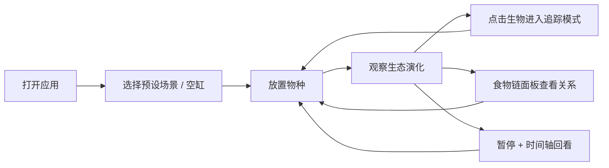

# 3D 虚拟生态缸 — 产品需求文档（PRD）

## 1. 产品概述

面向中小学自然观察课的 3D 虚拟生态缸教学应用：学生在浏览器中放置不同物种、观察食物链动态与昼夜生态演化。
- 解决课堂无法长期、安全观察真实生态系统的痛点，让食物链、能量流动、生态平衡等抽象概念可视化。
- 目标用户：中小学教师与学生；价值：零成本、可重复、可回看的生态实验课堂工具。

## 2. 核心功能

### 2.1 用户角色

| 角色 | 使用方式 | 核心权限 |
|------|----------|----------|
| 学生/教师 | 无需注册，打开即用 | 全部功能（放置物种、加载场景、追踪、回看） |

### 2.2 功能模块

1. **3D 生态缸主场景**：玻璃缸体、水草/底砂装饰、实时光影、自由环绕相机
2. **物种放置面板**：按营养级分类的物种库，点击后放入缸中
3. **预设生态场景**：淡水湖泊、热带雨林微缩、污染水域，一键加载
4. **生态系统模拟**：捕食/被捕食、能量代谢、繁殖与死亡、生产者光合作用
5. **昼夜循环**：白天明亮、夜晚昏暗；夜行/昼行生物真实作息（休眠、减速、发光、生产者夜间停止产能）
6. **生物追踪模式**：点击生物进入追踪，相机跟随、光环高亮、信息面板实时刷新
7. **食物链面板**：食物网节点图，点击高亮对应物种，悬停显示捕食/被捕食关系详情
8. **历史时间轴**：记录生态快照，暂停后可拖动时间轴回看任意时刻状态

### 2.3 页面详情

| 页面名称 | 模块名称 | 功能描述 |
|----------|----------|----------|
| 主观察页（单页应用） | 顶部工具栏 | 场景预设选择、播放/暂停、速度调节、昼夜时钟显示 |
| 主观察页 | 3D 生态缸视口 | R3F 渲染缸体与生物；左键旋转/滚轮缩放；点击生物进入追踪 |
| 主观察页 | 物种放置面板（左侧） | 物种卡片（名称、营养级、图标），点击放置；显示当前存活数量 |
| 主观察页 | 生物信息面板（右侧） | 追踪模式下实时显示：名称、能量、饥饿度、状态（活动/休眠/发光）、年龄 |
| 主观察页 | 食物链面板（底部） | 食物网节点连线图；点击节点高亮 3D 物种；悬停展示捕食关系气泡详情 |
| 主观察页 | 时间轴（底部） | 拖动滑块回看历史快照（种群数量、个体状态），恢复播放回到实时 |
| 主观察页 | 生态统计条 | 各营养级生物量、系统总能量、当前昼夜时段 |

## 3. 核心流程

学生打开应用 → 选择预设场景（或空缸自行放置物种）→ 观察生态系统演化 → 点击感兴趣生物进入追踪模式观察其行为与数据 → 打开食物链面板理解物种关系 → 暂停并拖动时间轴回看关键时刻（如某物种灭绝、种群爆发）→ 调整物种构成重新实验。

## 4. 用户界面设计

### 4.1 设计风格

- **整体基调**：自然科学实验室 × 水族馆观察窗。深色墨青背景突出缸内生态，玻璃拟态面板
- 主色：深青蓝 `#06232B`（背景）；强调色：荧光水绿 `#3EE6C4`、暖阳橙 `#FFB454`（昼）、月光蓝 `#7FA8FF`（夜）
- 面板：半透明玻璃拟态（backdrop-blur + 细描边），圆角 12px
- 字体：标题 "Noto Serif SC"（教科书衬线感），正文/数据 "ZCOOL XiaoWei" / 系统无衬线；数字用等宽
- 图标：线性 SVG 图标 + 物种用 emoji 辅助识别（🐟🦐🌿），贴合中小学生认知
- 布局：中央 3D 视口最大化，四周悬浮玻璃面板，可折叠

### 4.2 页面设计概览

| 页面名称 | 模块名称 | UI 元素 |
|----------|----------|---------|
| 主观察页 | 顶部工具栏 | 玻璃拟态横条、场景下拉、播放控制按钮、昼夜指示器（太阳/月亮图标 + 进度环） |
| 主观察页 | 3D 视口 | 玻璃缸体、水体次表面色、焦散光斑、气泡粒子、生物发光点光源 |
| 主观察页 | 物种面板 | 卡片网格：物种 emoji、中文名、营养级色条、当前数量徽标 |
| 主观察页 | 信息面板 | 追踪目标数据卡片、能量/饥饿进度条、状态标签（活动/休眠/发光） |
| 主观察页 | 食物链面板 | 横向分层节点图（生产者→初级→次级消费者），连线表捕食方向，悬停浮层 |
| 主观察页 | 时间轴 | 刻度滑块、快照缩略数据提示、关键事件标记（出生/死亡） |

### 4.3 响应式

桌面优先（课堂大屏/电脑）；面板在窄屏自动折叠为抽屉；触控支持旋转/缩放/点选。

### 4.4 3D 场景指引

- 环境：程序化玻璃缸（透明 MeshPhysicalMaterial + 透射），水体用半透明体积色与焦散纹理动画
- 光照：白天 DirectionalLight 暖阳 + 天光 AmbientLight；夜晚切换为冷蓝月光 + 低环境光，夜行生物使用自发光 + PointLight
- 相机：PerspectiveCamera 45°，OrbitControls 环绕；追踪模式下插值跟随目标生物
- 构图：缸体居中偏下，顶部留出水面光斑；生物按水层分布（底栖/中层/上层）
- 交互：射线拾取点击生物；悬停指针变化；追踪光环用发光环 + 呼吸缩放动画
- 后处理：Bloom（夜间发光）、Vignette、轻微色差；性能预算 ≤ 150 个生物实体，几何体实例化复用
- 资源：全部程序化几何体 + Canvas 纹理，无外部模型依赖
