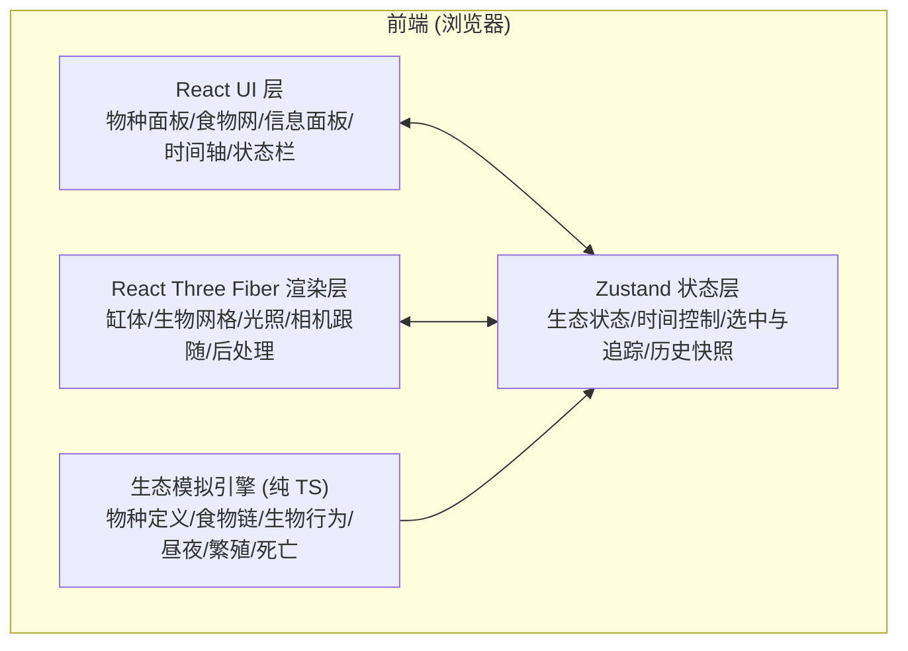

# 技术架构文档：3D 虚拟生态缸（EcoSphere Lab）

## 1. 架构设计

本项目为纯前端单页应用，无后端。生态模拟、3D 渲染、历史快照全部在浏览器中完成，状态由 Zustand 集中管理，React 负责 UI 面板，React Three Fiber 负责 3D 渲染。



**分层职责**：

- **UI 层（React + Tailwind）**：只负责展示与派发用户意图（放置物种、切换场景、拖动时间轴、点击节点），不持有生态业务状态。
- **状态层（Zustand）**：单一可信源，保存当前生态快照、时间控制（播放/倍速/当前时刻）、选中/追踪目标、历史快照数组。
- **模拟引擎（纯 TS 类/函数）**：框架无关，每个 tick 接收当前状态 + 增量时间，返回下一状态；便于做快照、回放、测试。
- **渲染层（R3F + drei + postprocessing）**：订阅状态，把生物数组映射为 3D 网格；处理点击拾取、相机跟随、昼夜光照、Bloom 发光。

## 2. 技术说明

- **前端框架**：React@18 + TypeScript@5 + Vite@5
- **3D 渲染**：three@0.160 + @react-three/fiber@8 + @react-three/drei@9 + @react-three/postprocessing@2
- **状态管理**：zustand@4（带中间件持久化可选，本项目默认不持久化）
- **样式**：tailwindcss@3
- **图标**：lucide-react
- **工具库**：无重型工具；随机数使用带种子的伪随机（便于场景复现）
- **后端 / 数据库**：无（纯前端，所有数据为内置物种定义与场景预设）
- **初始化工具**：`npm create vite@latest`（react-ts 模板）

> 类型约束：严格 TypeScript，`tsconfig` 开启 `strict: true`、`noUncheckedIndexedAccess: true`；**全项目禁止使用 `any`**（必要时用 `unknown` + 类型守卫，或定义精确类型）。

## 3. 路由定义

单页应用，无多路由。仅一个工作台视图。

| 路由 | 用途 |
|------|------|
| `/` | 主工作台（3D 生态缸 + 全部面板） |

## 4. 核心数据模型

所有模拟与 UI 共享以下类型（定义在 `src/simulation/types.ts`）。

```ts
// 营养级分类
type TrophicLevel = 'producer' | 'primary' | 'secondary' | 'apex' | 'decomposer';

// 昼夜节律
type CircadianType = 'diurnal' | 'nocturnal' | 'any';

// 物种静态定义（模板，不变）
interface SpeciesDef {
  id: string;                 // 唯一 id，如 'zooplankton'
  name: string;               // 中文名
  latin?: string;             // 拉丁名（展示用）
  trophic: TrophicLevel;
  color: string;              // 主色 hex
  emoji?: string;
  // 行为/生态参数
  prey: string[];             // 可捕食的物种 id 列表
  energyGain: number;         // 捕食/光合获得能量
  maxEnergy: number;
  moveSpeed: number;
  sizeRange: [number, number];
  lifespan: number;           // 寿命（秒，模拟时间）
  reproductionThreshold: number; // 繁殖所需能量
  reproductionCost: number;
  circadian: CircadianType;
  nocturnalGlow?: boolean;    // 夜间是否发光
  habitat: 'water' | 'bottom' | 'air' | 'surface';
  description: string;
}

// 单个生物的运行时状态
interface Creature {
  id: string;                 // 实例 id
  speciesId: string;
  position: [number, number, number];
  velocity: [number, number, number];
  energy: number;
  age: number;                // 已存活模拟秒数
  alive: boolean;
  targetId?: string;          // 当前捕食目标
  // 渲染辅助
  seed: number;
  scale: number;
}

// 环境状态
type PhaseName = 'dawn' | 'day' | 'dusk' | 'night';

interface EnvironmentState {
  timeOfDay: number;          // 0..1（一个昼夜周期）
  dayCount: number;
  phase: PhaseName;
  sunIntensity: number;       // 0..1
  ambientIntensity: number;
  waterTint: string;
  isNight: boolean;
}

// 某一时刻的完整生态快照（用于历史回放）
interface Snapshot {
  tick: number;               // 逻辑帧序号
  simTime: number;            // 累计模拟秒数
  creatures: Creature[];
  env: EnvironmentState;
  populations: Record<string, number>; // speciesId -> 数量
}

// 预设场景
interface PresetScene {
  id: string;
  name: string;
  description: string;
  gradient: [string, string]; // 卡片渐变
  waterTint: string;
  fogTint: string;
  // 初始种群：speciesId -> 数量
  populations: Record<string, number>;
  pollution?: number;         // 0..1 污染度，影响生物存活
}
```

### 4.1 食物网关系（内置物种）

| 物种 | 营养级 | 捕食 |
|------|--------|------|
| 浮游植物 phytoplankton | 生产者 | —（光合） |
| 水草 watergrass | 生产者 | —（光合） |
| 浮游动物 zooplankton | 初级 | 浮游植物 |
| 小鱼 minnow | 初级 | 浮游动物、浮游植物 |
| 螺蛳 snail | 初级/分解者 | 浮游植物、腐殖质 |
| 青鱼 carp | 次级 | 小鱼、螺蛳、浮游动物 |
| 蜻蜓幼虫 dragonfly | 次级 | 浮游动物、小鱼 |
| 黑鱼 snakehead | 顶级 | 小鱼、青鱼、蜻蜓幼虫 |
| 水鸟 waterbird | 顶级 | 小鱼、青鱼 |
| 萤火虫 firefly（雨林/夜间发光） | 初级 | 浮游植物/腐殖质 |
| 孑孓 larva（污染水） | 初级 | 腐殖质 |
| 水蛭 leech（污染水） | 次级 | 小鱼、孑孓 |

### 4.2 预设场景

- **淡水湖泊**：清水青调；浮游植物、水草、浮游动物、小鱼、螺蛳、青鱼、蜻蜓幼虫、黑鱼/水鸟少量。
- **热带雨林微缩**：偏绿、多水草/地表苔藓；加入萤火虫（夜间发光）、水鸟、蜻蜓、小鱼；物种最丰富。
- **污染水域**：偏暗褐/灰绿、雾重；耐污物种（孑孓、水蛭、浮游植物）多，清水物种（青鱼、水鸟）少且持续掉能量，演示环境压力。

## 5. 状态管理（Zustand Store）

Store 切片：

```ts
interface EcoStore {
  // 模拟数据
  creatures: Creature[];
  env: EnvironmentState;
  species: Record<string, SpeciesDef>;
  currentSceneId: string;

  // 时间控制
  playing: boolean;
  speed: 1 | 2 | 4;
  tick: number;
  simTime: number;

  // 交互
  selectedCreatureId: string | null;
  trackedSpeciesId: string | null;   // 食物网点击高亮物种
  hoveredSpeciesId: string | null;   // 食物网悬停
  inspectingCreatureId: string | null; // 追踪面板目标

  // 历史
  snapshots: Snapshot[];       // 环形/上限数组
  viewingIndex: number | null; // 非 null 表示回看快照

  // actions
  loadScene: (id: string) => void;
  addSpecies: (speciesId: string, count?: number) => void;
  removeCreature: (id: string) => void;
  selectCreature: (id: string | null) => void;
  trackCreature: (id: string | null) => void;
  setHoveredSpecies: (id: string | null) => void;
  play: () => void;
  pause: () => void;
  setSpeed: (s: 1 | 2 | 4) => void;
  seekSnapshot: (index: number | null) => void;
  reset: () => void;
  step: (dt: number) => void; // 由渲染循环调用，推进一帧
}
```

**模拟循环**：在 `App` 的 R3F `useFrame` 中，根据 `playing`、`speed` 累计真实时间，每达到一个固定逻辑步长（如 0.1 模拟秒）调用 `step()`。`step()` 内部运行纯函数 `tickSimulation(state, dt)`，生成新状态；每隔 N 个 tick 把当前快照压入 `snapshots`（上限约 200 张，超出丢弃最旧）。

**回看机制**：当 `viewingIndex !== null`，3D 渲染层与面板读取 `snapshots[viewingIndex]` 而非实时 `creatures`，模拟循环暂停推进；点击播放则 `seekSnapshot(null)` 回到实时（从最后一张快照继续）。

## 6. 模拟引擎设计（`src/simulation/`）

- `species.ts`：内置物种定义表与查询函数。
- `presets.ts`：三个预设场景定义。
- `engine.ts`：`tickSimulation(prev, dt)` 纯函数，依次执行：
  1. **昼夜推进**：`timeOfDay += dt / DAY_LENGTH`；计算 phase、光照强度、水色。
  2. **生产者光合**：白天且非污染环境，能量增长；夜间停止。
  3. **行为决策**：每只生物根据能量/昼夜寻找猎物或游荡；夜行性夜间活跃、日行性夜间减速休眠。
  4. **移动与边界**：按速度积分位置，在缸内反弹；休眠生物速度大幅降低。
  5. **捕食**：接触到猎物且在食物链中 → 猎物死亡、捕食者能量增加。
  6. **能量消耗/繁殖/死亡**：每 tick 消耗能量；能量达阈值且周围有同种则繁殖（分裂/生成新个体）；能量耗尽或寿命到则死亡。
  7. **污染效果**（污染水域）：不耐污物种持续掉能量。
- `rng.ts`：带种子的 Mulberry32 伪随机，保证预设可复现。

## 7. 渲染层设计（`src/components/three/`）

- `Tank.tsx`：玻璃缸（半透明立方体 + 边缘描边）、缸底沙地、水草/岩石装饰、水体雾。
- `Lights.tsx`：半球光 + 方向光（太阳）+ 夜间月光；方向光位置/强度/色温随 `env` 插值；发光生物挂点光源。
- `Creatures.tsx`：按物种分组，用 `InstancedMesh` 或映射为低多边形 `<CreatureMesh>`；订阅 creatures，读取位置/朝向/缩放；夜间发光物种用 `emissive` + Bloom。
- `CreatureMesh.tsx`：用球体/锥体/胶囊组合出鱼类/浮游/水草等形态；加顶点摆动动画；处理 `onClick` 选中；被追踪/高亮物种显示光环（`<Ring>`/sprite）。
- `CameraRig.tsx`：默认 `OrbitControls`；当存在 `inspectingCreatureId` 时，每帧平滑插值相机到"目标侧后方"，并临时禁用 controls 的旋转。
- `Effects.tsx`：`@react-three/postprocessing` 的 Bloom（夜间强度更高）+ Vignette。
- `Scene.tsx`：组合上述组件，从 store 读取 `viewingIndex` 决定渲染实时还是快照数据。

## 8. UI 组件设计（`src/components/ui/`）

- `TopBar.tsx`：标题、各营养级数量胶囊、天数、重置。
- `LeftPanel.tsx`：场景卡片 + 物种库（按营养级分组，彩色圆点 + 名称 + +按钮）。
- `FoodWebPanel.tsx`：SVG 分层食物网。节点位置在 `src/simulation/foodWebLayout.ts` 中按营养级分层预计算；边为带箭头 path；悬停高亮关联并显示 tooltip（捕食/被捕食）；点击节点设置 `trackedSpeciesId`。
- `InfoPanel.tsx`：追踪/选中生物的实时数据卡（物种名、状态徽章、能量条、年龄、目标、简介）。
- `Timeline.tsx`：播放/暂停、倍速、可拖动 range（背景为昼夜渐变，刻度=快照）、时间显示、回看徽标；迷你种群面积图。
- `ui/` 目录：`Button`、`Card`、`Badge`、`Slider` 等基础组件，保持视觉统一。

## 9. 目录结构

```
src/
  main.tsx
  App.tsx
  index.css                 # tailwind + 字体/全局变量
  store/
    ecoStore.ts             # zustand store
  simulation/
    types.ts                # 全部核心类型（禁 any）
    species.ts              # 物种定义
    presets.ts              # 预设场景
    engine.ts               # tickSimulation 纯函数
    foodWebLayout.ts        # 食物网节点坐标
    rng.ts                  # 种子随机
    format.ts               # 时间/数字格式化
  components/
    three/
      Scene.tsx
      Tank.tsx
      Lights.tsx
      Creatures.tsx
      CreatureMesh.tsx
      CameraRig.tsx
      Effects.tsx
    ui/
      TopBar.tsx
      LeftPanel.tsx
      FoodWebPanel.tsx
      InfoPanel.tsx
      Timeline.tsx
      primitives.tsx        # Button/Card/Badge/Slider
  hooks/
    useSimulationLoop.ts    # useFrame 驱动 step
```

## 10. 关键算法与约定

- **缸体坐标系**：缸宽 16（x: -8..8）、高 10（y: 0..10）、深 10（z: -5..5）。水面 y≈6；水下生物在 y∈[0.5,5.8]，水面/空中在 y∈[6,9.5]，水底植物 y≈0.2。
- **昼夜长度**：`DAY_LENGTH = 120` 模拟秒（1x 下约 2 分钟一天，便于课堂观察）；倍速对应压缩。
- **快照频率**：每 `SNAPSHOT_INTERVAL = 1` 模拟秒存一张，上限 `MAX_SNAPSHOTS = 240`（约 2 个完整昼夜，覆盖回放需求）。
- **性能**：同屏生物软上限 120；按物种批渲染；后处理 Bloom 仅对 emissive 物体生效；`useFrame` 内避免分配新对象。
- **可回放纯函数**：引擎 `tickSimulation` 为纯函数（除注入的 rng），使快照与回放严格一致。

## 11. 验证与质量

- `npm run build`（含 `tsc --noEmit`）必须通过，无 `any`。
- 无后端，手工验证：加载三个预设、放置/移除物种、点击追踪、拖动时间轴回看、昼夜变化与夜间发光/休眠。
