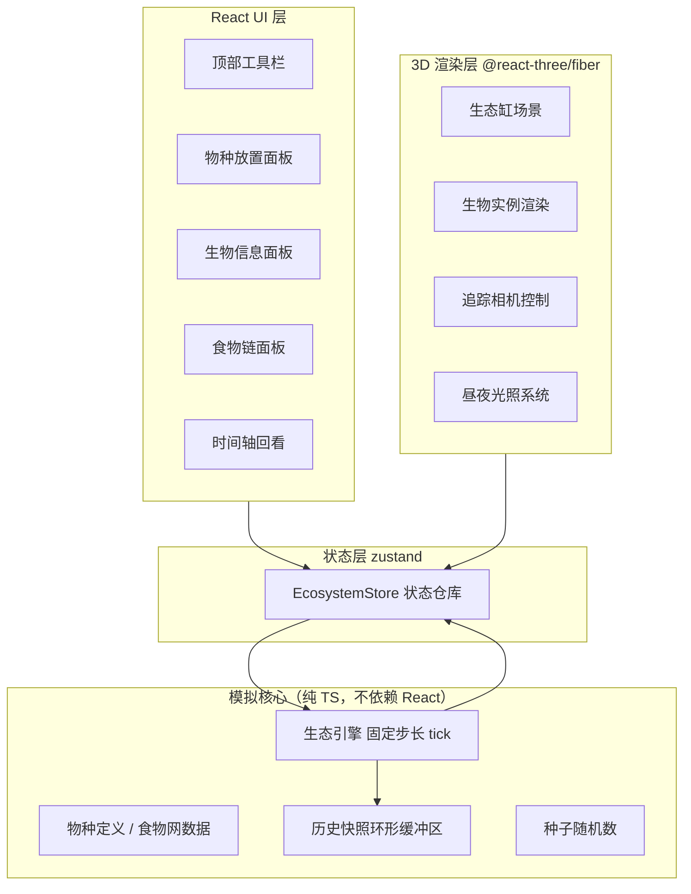

# 3D 虚拟生态缸 — 技术架构文档

## 1. 架构设计

纯前端单页应用，无后端。生态模拟在独立引擎模块中以固定步长运行，渲染层通过订阅读取状态；历史快照存于内存环形缓冲区。



## 2. 技术描述

- 前端：React@18 + TypeScript@5（strict，禁用 any）+ Vite@5
- 3D：three + @react-three/fiber + @react-three/drei + @react-three/postprocessing
- 状态管理：zustand（模拟状态 + UI 状态分离）
- 样式：tailwindcss@3 + CSS 变量主题
- 后端：无；数据库：无（内存态，快照环形缓冲容量 600 条）
- 初始化工具：vite-init（react-ts 模板）

## 3. 路由定义

| 路由 | 用途 |
|------|------|
| / | 主观察页（单页应用，全部功能） |

## 4. 核心模块划分

| 模块 | 文件 | 职责 |
|------|------|------|
| 类型定义 | src/types/ecosystem.ts | SpeciesId、Creature、Snapshot、FoodWebNode 等全部类型（无 any） |
| 物种数据 | src/data/species.ts | 物种表：营养级、食性、作息（昼行/夜行）、发光、速度、寿命 |
| 预设场景 | src/data/presets.ts | 淡水湖泊 / 热带雨林微缩 / 污染水域 的初始种群与水质参数 |
| 生态引擎 | src/engine/simulation.ts | tick：代谢、捕食、繁殖、死亡、作息切换、生产者产能 |
| 快照历史 | src/engine/history.ts | 环形缓冲记录快照，按时间索引读取 |
| 状态仓库 | src/store/ecosystemStore.ts | zustand：生物列表、播放状态、追踪目标、时间轴位置 |
| 3D 场景 | src/three/TankScene.tsx 等 | 缸体、水体、装饰、光照、后处理 |
| 生物渲染 | src/three/CreatureMesh.tsx | 程序化几何体（鱼/虾/螺/水草），游动动画、发光材质 |
| 追踪系统 | src/three/TrackingRig.tsx | 相机插值跟随 + 光环高亮 |
| UI 面板 | src/components/*.tsx | 工具栏、物种面板、信息面板、食物链面板、时间轴 |

## 5. 关键数据模型（TypeScript 类型）

```typescript
// 营养级：生产者 → 顶级消费者
type TrophicLevel = 1 | 2 | 3;

// 作息类型：昼行 / 夜行 / 全天
type CircadianType = 'diurnal' | 'nocturnal' | 'cathemeral';

interface SpeciesDef {
  id: SpeciesId;              // 物种唯一标识（联合字面量类型）
  name: string;               // 中文名
  emoji: string;
  trophicLevel: TrophicLevel;
  diet: SpeciesId[];          // 捕食对象
  circadian: CircadianType;
  bioluminescent: boolean;    // 夜晚是否发光
  baseSpeed: number;
  maxEnergy: number;
  lifespan: number;           // 秒
  reproduceThreshold: number; // 繁殖能量阈值
}

interface Creature {
  id: string;                 // 个体 id
  speciesId: SpeciesId;
  position: [number, number, number];
  velocity: [number, number, number];
  energy: number;
  hunger: number;             // 0-100
  age: number;
  status: 'active' | 'sleeping' | 'dead';
  glowing: boolean;           // 当前是否发光
}

interface Snapshot {
  tick: number;
  timestamp: number;          // 模拟内时间（秒）
  phase: DayPhase;            // 昼夜相位
  counts: Record<SpeciesId, number>;
  creatures: Creature[];      // 深拷贝快照
}

type DayPhase = 'dawn' | 'day' | 'dusk' | 'night';

interface PresetScene {
  id: 'freshwater-lake' | 'rainforest' | 'polluted-water';
  name: string;
  description: string;
  waterQuality: number;       // 0-1，影响生产者效率与生物寿命
  initialStock: Array<{ speciesId: SpeciesId; count: number }>;
}
```

## 6. 模拟规则概要

- 固定步长 100ms/tick，播放速度 1x/2x/4x 可调
- 昼夜周期 120s：day 60% / night 30% / dawn·dusk 过渡各 5%
- 生产者：白天按光照强度产出能量，夜晚停止产出并缓慢消耗
- 消费者：移动耗能量，饥饿时主动搜寻最近猎物；捕食成功转移能量
- 作息：夜行种白天休眠（减速 80%），昼行种夜晚休眠；发光种仅夜晚自发光
- 繁殖：能量超过阈值且同类数量未达上限时消耗能量产生后代
- 死亡：能量归零（饿死）或年龄超过寿命；尸体缓慢下沉后移除
- 水质（污染场景）：乘算于生产者效率，并使生物寿命缩短
- 每 10 tick（1s）写入一次快照，容量 600 条（约 10 分钟回放）

## 7. 性能与约束

- 生物实体上限 150，几何体/材质共享，InstancedMesh 渲染气泡
- 追踪模式相机使用阻尼插值，退出后平滑还原
- tsconfig 开启 strict + noImplicitAny，代码全中文注释
